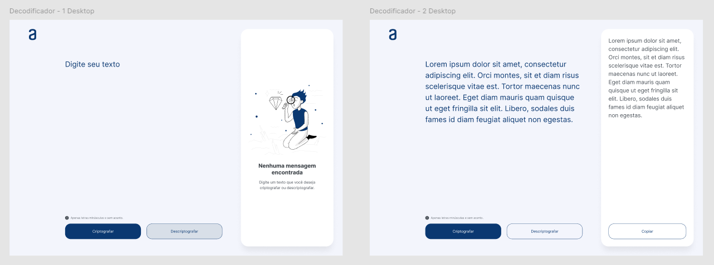
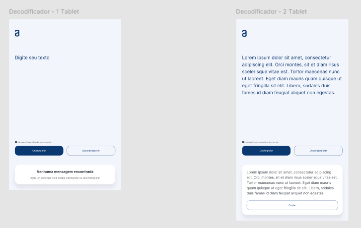
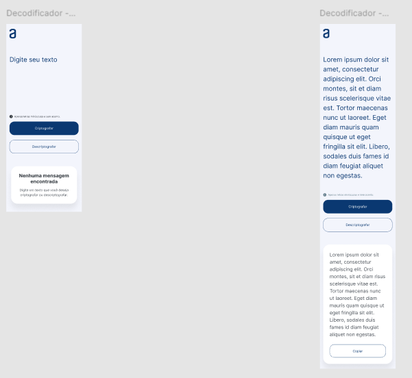
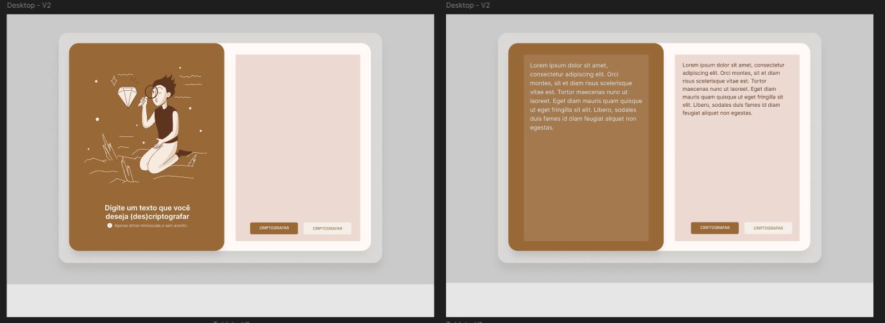
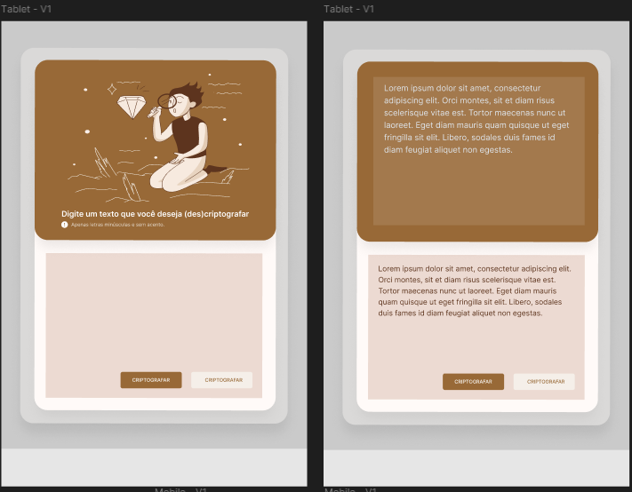
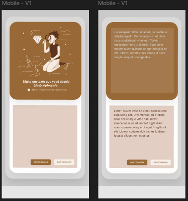

<!-- Introdução -->
<h1 align="center">
    Oracle Next Education (ONE-T7): Decoder Challenge
</h1>

    
    
    
    
    

<h2>Descrição</h2>

    Desafio da Oracle Next Education (Turma 7): site 'one-page' de decodificação.

<!-- Sumário -->
<h2>Sumário</h2>

<ul>
    <li>
        <a href="requisitos">Requisitos</a>
    </li>
    <li>
        <a href="chaves">Chaves de Criptografia</a>
    </li>
    <li>
        <a href="visual">Identidade Visual</a>
    </li>
    <li>
        <a href="#referencias">Referências</a>
    </li>
    <li>
        <a href="#licenca">Licença</a>
    </li>
</ul>

<!-- Requisitos -->
<h2 id="requisitos">Requisitos</h2>
<ul>
    <li>
        Deve funcionar apenas com letras minúsculas;
    </li>
    <li>
        Não devem ser utilizados letras com acentos nem caracteres especiais;
    </li>
    <li>
        Deve ser possível converter uma palavra para a versão criptografada e também retornar uma palavra criptografada para a versão original;
    </li>
    <li>
        A página deve ter campos para inserção do texto a ser criptografado ou descriptografado, e a pessoa usuária deve poder escolher entre as duas opções;
    </li>
    <li>
        O resultado deve ser exibido na tela.
    </li>
</ul>

<!-- Chaves -->
<h2 id="chaves">Chaves de Criptografia</h2>

    A letra <code>a</code> é convertida para <code>ai</code> 
     
    A letra <code>e</code> é convertida para <code>enter</code> 
     
    A letra <code>i</code> é convertida para <code>imes</code> 
     
    A letra <code>o</code> é convertida para <code>ober</code> 
     
    A letra <code>u</code> é convertida para <code>ufat</code> 

<!-- Identidade Visual -->
<h2 id="visual">Identidade Visual</h2>

<h3>Protótipo da Alura</h3>

    
Versão Desktop

    

    
Versão Tablet

    

    
Versão Mobile

    

<h3>Versão Modificada</h3>

    
Versão Desktop

    

    
Versão Tablet

    

    
Versão Mobile

    

<!-- Referências -->
<h2 id="referencias">Referências</h2>
<ul>
    <li>
        <a href="https://developer.mozilla.org/pt-BR/">MDN Web Docs</a>
    </li>
    <li>
        <a href="https://www.w3schools.com/">W3Schools</a>
    </li>
    <li>
        <a href="https://caelum-online-public.s3.amazonaws.com/one-tgf/Challenge_-_Decodificador_vfinal_4.pdf">Manual do Desafio ONE</a>
    </li>
    
</ul>

<!-- Licença -->
<h2 id="licenca">Licença</h2>

The [MIT License](/LICENSE) (MIT)

Copyright :copyright: 2024 - Oracle Next Education (ONE-T7): Decoder Challenge
